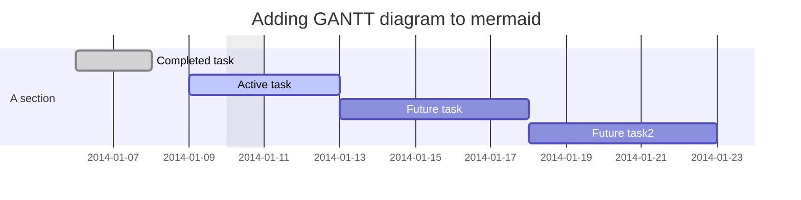

## TOPIC_NAME

TOPIC_DETAILS
blah blah blah...

## Table of Contents

- topic content 1
- Renders actual, "native" React DOM elements
- Allows you to escape or skip HTML (try toggling the checkboxes above)
- If you escape or skip the HTML, no `dangerouslySetInnerHTML` is used! Yay!

## Getting started

Preliminary question:

<button onClick={() => alert(42)}>
  What is the answer to the mystery of universe ??
</button>

## HTML block below

<blockquote>
  This blockquote will change based on the HTML settings above.
</blockquote>

## How about some code?

```js
var React = require("react");
var Markdown = require("react-markdown");
React.render(
  <Markdown source="# Your markdown here" />,
  document.getElementById("content")
);
```

Pretty neat, eh?

## Tables?

| :Feature  | :Support |
| --------- | -------- |
| tables    | ✔        |
| alignment | ✔        |
| limit :   | ✔        |

## More info?


